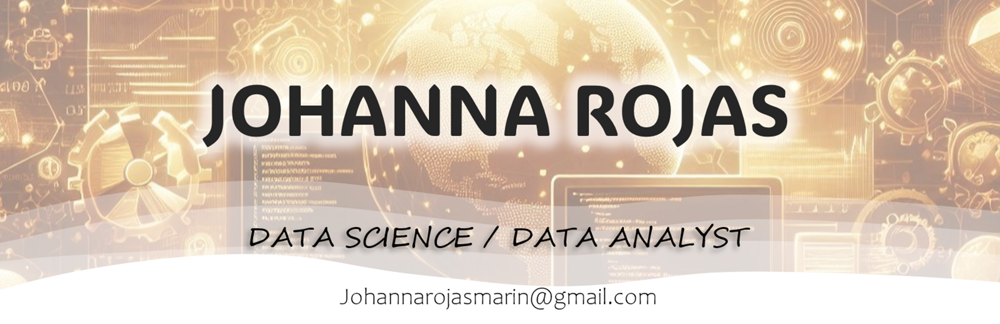

##  **Hi there** :wave:, **I'm ...**

I am a results-oriented Physics Engineer and Master of Medical Physics with a passion for data science and active learning. 

My strong background in the exact sciences, combined with my experience in research and teaching, enables me to translate complex information into actionable insights. I am committed to driving innovation and contributing to the development of innovative solutions.

:chart_with_upwards_trend: Currently, I'm expanding my data science skillset through intensive courses on Platzi.

## :sound:***Contact me***

<table>
  <tr>
    <td></td>
    <td style="text-align: center;">Check out my profile</td>
  </tr>
</table>
<table>
  <tr>
    <td></td>
    <td style="text-align: center;">Check out my profile</td>
  </tr>
</table>

## 🛠***Languages and Tools***
</img>

<!--
**Johanna-Rojas/Johanna-Rojas** is a ✨ _special_ ✨ repository because its `README.md` (this file) appears on your GitHub profile.

Here are some ideas to get you started:

- 🔭 I’m currently working on ...
- 🌱 I’m currently learning ...
- 👯 I’m looking to collaborate on ...
- 🤔 I’m looking for help with ...
- 💬 Ask me about ...
- 📫 How to reach me: ...
- 😄 Pronouns: ...
- ⚡ Fun fact: ...
-->
